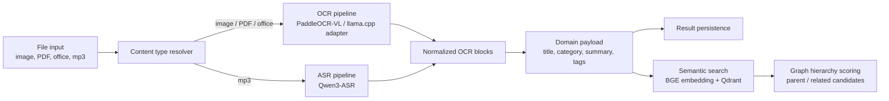

# Snapocket AI Workspace


`ai/`는 Snapocket의 문서 이해, 오디오 전사, 시맨틱 검색, 지식 그래프 생성을 담당하는 AI 워크스페이스입니다.
목표는 단순히 OCR 결과를 반환하는 것이 아니라, 사용자가 업로드한 파일을 **검색 가능한 지식 단위**로 변환하는 것입니다.

## What It Does

- **문서 OCR**: 이미지, PDF, 오피스 문서를 PaddleOCR-VL 기반 파이프라인으로 분석합니다.
- **오디오 전사**: `.mp3` 입력은 Qwen3-ASR 경로로 자동 분기합니다.
- **도메인 정규화**: 추출된 텍스트를 제목, 카테고리, 요약, 태그, 주요 개념으로 변환합니다.
- **시맨틱 검색**: 문서를 chunk 단위로 임베딩하고 Qdrant에 저장해 사용자 범위 검색을 제공합니다.
- **지식 그래프**: 문서 간 의미적 포함 관계와 유사 관계를 계산해 그래프 edge 후보를 만듭니다.
- **AIOps 런타임**: 모델 상태, job, 서버 라우팅, 실행 로그를 관측 가능한 형태로 관리합니다.

## Architecture



## Core Code

| File | Role |
| --- | --- |
| `service/backend/app/services/pipeline.py` | 파일 타입별 OCR/ASR 실행, PDF 텍스트 추출, 이미지 전처리, 후처리, domain payload 생성을 담당하는 메인 파이프라인 |
| `service/backend/app/services/ocr/router.py` | 로컬 OCR 엔진 선택을 단순화한 라우터. 현재는 Paddle 계열 단일 엔진을 안정적으로 선택 |
| `service/backend/app/services/ocr/llamacpp_engine.py` | llama.cpp OpenAI-compatible API를 OCR 엔진처럼 감싸는 adapter |
| `service/backend/app/services/ocr/paddle_doc_parser_engine.py` | PaddleOCR-VL document parser pipeline 연동 |
| `service/backend/app/services/asr/qwen_asr_engine.py` | Qwen3-ASR 모델을 lazy-load하고 오디오 전사를 비동기로 실행 |
| `service/backend/app/services/domain_transformer.py` | OCR/ASR 결과를 Snapocket 도메인 스키마로 정규화 |
| `service/backend/app/services/semantic_search.py` | BGE 계열 임베딩, Qdrant collection 관리, chunk upsert/delete/search 담당 |
| `service/backend/app/services/graph_hierarchy.py` | chunk embedding coverage 기반으로 parent/related edge 후보 점수화 |
| `service/backend/app/services/state.py` | 설정, 모델, 저장소, queue, 검색 서비스를 조립하는 composition root |


## Runtime

현재 기본 런타임은 다음 구성을 기준으로 합니다.

| Area | Runtime |
| --- | --- |
| OCR | PaddleOCR-VL document parser |
| VLM backend | llama.cpp server, OpenAI-compatible API |
| ASR | Qwen3-ASR-1.7B |
| Embedding | BGE 계열 sentence-transformer |
| Vector DB | Qdrant |
| Job queue | memory queue 또는 Redis |
| Persistence | SQLite fallback 또는 Postgres |


## Directory

```text
ai/
├─ model/                 # 로컬 오픈소스 모델 저장소
├─ service/
│  ├─ backend/app/         # AI API, pipeline, model runtime, search, graph
│  └─ frontend/            # AIOps 화면 템플릿과 정적 파일
├─ data/                  # 로컬 DB와 테스트 데이터
├─ Makefile               # AI workspace 단일 실행 진입점
└─ directory.md           # 폴더 구조 메모
```

## Integration Boundary

이 워크스페이스는 Snapocket의 일반 백엔드/프론트엔드를 직접 설명하기보다,
그들이 호출할 수 있는 AI 결과를 만드는 데 집중합니다.
외부 시스템은 `/analyze`, `/v1/backend/analyze`, semantic search API, graph API를 통해
정규화된 문서 결과와 검색/그래프 후보를 사용할 수 있습니다.

## References

- Service details: `service/README.md`
- Model download notes: `model/how_to_download_model.md`
- Server configuration notes: `service/SERVER_CONFIG_VALUES.md`
