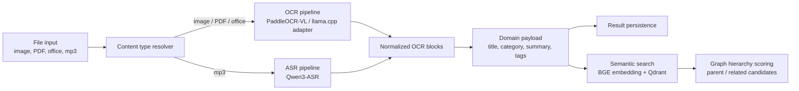
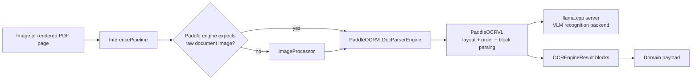
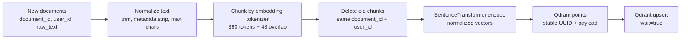

# Snapocket AI Workspace


`ai/`는 Snapocket의 문서 이해, 오디오 전사, 시맨틱 검색, 지식 그래프 생성을 담당하는 AI 워크스페이스입니다.
목표는 단순히 OCR 결과를 반환하는 것이 아니라, 사용자가 업로드한 파일을 **검색 가능한 지식 단위**로 변환하는 것입니다.

## What It Does

- **문서 OCR**: 이미지, PDF, 오피스 문서를 PaddleOCR-VL 기반 파이프라인으로 분석합니다.
- **오디오 전사**: `.mp3` 입력은 Qwen3-ASR 경로로 자동 분기합니다.
- **도메인 정규화**: 추출된 텍스트를 제목, 카테고리, 요약, 태그, 주요 개념으로 변환합니다.
- **시맨틱 검색**: 문서를 chunk 단위로 임베딩하고 Qdrant에 저장해 사용자 범위 검색을 제공합니다.
- **지식 그래프**: 문서 간 의미적 포함 관계와 유사 관계를 계산해 그래프 edge 후보를 만듭니다.
- **AIOps 런타임**: 모델 상태, job, 서버 라우팅, 실행 로그를 관측 가능한 형태로 관리합니다.

## Architecture



## PaddleOCR-VL Architecture

Snapocket의 OCR은 `PaddleOCRVLDocParserEngine`을 중심으로 동작합니다.
여기서 중요한 점은 llama.cpp를 직접 OCR 엔진으로만 쓰는 것이 아니라,
**PaddleOCR-VL 공식 document parser pipeline을 주 파이프라인으로 두고 llama.cpp server를 VLM recognition backend로 붙인 것**입니다.



구현 흐름은 다음과 같습니다.

1. `state.py`에서 기본 OCR 엔진으로 `PaddleOCRVLDocParserEngine`을 조립합니다.
2. `router.py`는 현재 로컬 OCR 경로를 `paddle` 단일 엔진으로 제한합니다.
3. `paddle_doc_parser_engine.py`는 시작 시 바로 무거운 pipeline을 만들지 않고, 실제 OCR 호출 시 `_ensure_pipeline()`에서 lazy-load합니다.
4. availability probe는 `paddleocr` 패키지 import와 llama.cpp `/v1/models` 응답을 함께 확인합니다.
5. `PaddleOCRVL(..., vl_rec_backend="llama-cpp-server", vl_rec_server_url=...)` 형태로 공식 parser pipeline을 생성합니다.
6. PaddleOCR-VL 결과의 `parsing_res_list`, `blocks`, `layout`, `markdown` 후보를 공통 `OCREngineResult`로 변환합니다.
7. 첫 block에는 전체 `raw_text`를 담은 `structured_payload`를 붙여 후속 domain 변환에서 활용합니다.

이렇게 구현한 이유는 세 가지입니다.

- **레이아웃 보존**: 문서 OCR은 단순 텍스트 추출보다 표, 제목, footer, reading order가 중요합니다. 그래서 layout detection과 document assembly는 PaddleOCR-VL 공식 parser에 맡깁니다.
- **런타임 분리**: VLM recognition은 llama.cpp server로 분리해 모델 서버 상태를 별도로 probe하고 교체할 수 있게 했습니다.
- **안정적인 실패 처리**: OCR 엔진은 `ThreadPoolExecutor(max_workers=1)`로 감싸 한 번에 하나의 heavy inference만 실행하고, 중복 요청은 busy error로 명확히 돌려줍니다.

PDF의 경우에는 먼저 내장 텍스트와 표를 추출합니다.
디지털 PDF처럼 텍스트가 이미 있는 문서는 OCR을 건너뛰고, 비어 있는 페이지만 이미지로 렌더링해 PaddleOCR-VL 경로로 보냅니다.
이 방식은 OCR 비용을 줄이면서도 스캔 문서 처리는 유지하기 위한 선택입니다.

## Vector Embedding Flow

Vector embedding은 `SemanticSearchService`가 담당합니다.
서비스 시작 시 embedding model과 Qdrant client를 초기화하고, 실제 모델 출력 차원을 probe한 뒤 현재 collection의 vector size와 맞는지 확인합니다.
기본 모델은 `dragonkue/BGE-m3-ko`, 기본 collection은 `documents_v2`입니다.

### Indexing request

백엔드나 외부 시스템이 `/v1/search/upsert` 또는 `/v1/search/sync`로 새 문서 목록을 보내면 아래 순서로 처리됩니다.



핵심은 새 요청이 들어올 때 기존 chunk를 덮어쓰는 방식입니다.
같은 `document_id`의 이전 point가 남아 있으면 검색 결과가 stale data를 섞을 수 있기 때문에,
먼저 payload 기준으로 기존 chunk를 삭제하고 새 chunk들을 다시 upsert합니다.

chunking은 문장부호나 특정 언어 규칙에 의존하지 않습니다.
가능하면 embedding model tokenizer의 offset mapping으로 360 token 단위 chunk를 만들고,
토크나이저 offset을 사용할 수 없을 때만 fixed character window로 fallback합니다.
이렇게 한 이유는 한국어, 영어, 혼합 문서가 들어와도 같은 embedding model의 기준으로 검색 단위를 만들기 위해서입니다.

Qdrant point에는 vector뿐 아니라 아래 payload를 함께 저장합니다.

- `user_id`: 사용자별 검색 격리
- `document_id`: 문서 단위 집계와 삭제
- `chunk_id`, `chunk_index`: chunk 추적
- `offset_start`, `offset_end`: 원문 위치 추적
- `content_hash`: 같은 본문 여부 확인
- `chunk_text`: 검색 결과 snippet과 graph evidence

### Search request

검색 요청은 `/v1/search/semantic`에서 시작합니다.

1. query를 같은 SentenceTransformer로 embedding합니다.
2. Qdrant에서 `user_id` filter를 걸어 cosine similarity 검색을 수행합니다.
3. 요청 limit보다 넓은 후보군을 가져온 뒤, dense score와 reciprocal-rank 신호를 섞어 chunk 점수를 계산합니다.
4. chunk 결과를 `document_id` 기준으로 다시 묶고, 문서별 가장 강한 evidence chunk를 대표 결과로 반환합니다.
5. 응답에는 score뿐 아니라 `chunk_id`, `offset`, `snippet`, `retrieval_pipeline`이 포함되어 왜 검색됐는지 추적할 수 있습니다.

Graph API는 이 embedding 계층을 다시 사용합니다.
`/v1/graph/link`는 먼저 semantic search로 후보 문서를 좁히고,
source/candidate 문서의 chunk와 context를 다시 embedding해 parent 후보와 related 후보를 점수화합니다.
그래서 그래프 edge는 파일명이나 태그가 아니라 **raw text chunk evidence**를 기준으로 생성됩니다.

## Core Code

| File | Role |
| --- | --- |
| `service/backend/app/services/pipeline.py` | 파일 타입별 OCR/ASR 실행, PDF 텍스트 추출, 이미지 전처리, 후처리, domain payload 생성을 담당하는 메인 파이프라인 |
| `service/backend/app/services/ocr/router.py` | 로컬 OCR 엔진 선택을 단순화한 라우터. 현재는 Paddle 계열 단일 엔진을 안정적으로 선택 |
| `service/backend/app/services/ocr/llamacpp_engine.py` | llama.cpp OpenAI-compatible API를 OCR 엔진처럼 감싸는 adapter |
| `service/backend/app/services/ocr/paddle_doc_parser_engine.py` | PaddleOCR-VL document parser pipeline 연동 |
| `service/backend/app/services/asr/qwen_asr_engine.py` | Qwen3-ASR 모델을 lazy-load하고 오디오 전사를 비동기로 실행 |
| `service/backend/app/services/domain_transformer.py` | OCR/ASR 결과를 Snapocket 도메인 스키마로 정규화 |
| `service/backend/app/services/semantic_search.py` | BGE 계열 임베딩, Qdrant collection 관리, chunk upsert/delete/search 담당 |
| `service/backend/app/services/graph_hierarchy.py` | chunk embedding coverage 기반으로 parent/related edge 후보 점수화 |
| `service/backend/app/services/state.py` | 설정, 모델, 저장소, queue, 검색 서비스를 조립하는 composition root |


## Runtime

현재 기본 런타임은 다음 구성을 기준으로 합니다.

| Area | Runtime |
| --- | --- |
| OCR | PaddleOCR-VL document parser |
| VLM backend | llama.cpp server, OpenAI-compatible API |
| ASR | Qwen3-ASR-1.7B |
| Embedding | BGE 계열 sentence-transformer |
| Vector DB | Qdrant |
| Job queue | memory queue 또는 Redis |
| Persistence | SQLite fallback 또는 Postgres |


## Directory

```text
ai/
├─ model/                 # 로컬 오픈소스 모델 저장소
├─ service/
│  ├─ backend/app/         # AI API, pipeline, model runtime, search, graph
│  └─ frontend/            # AIOps 화면 템플릿과 정적 파일
├─ data/                  # 로컬 DB와 테스트 데이터
├─ Makefile               # AI workspace 단일 실행 진입점
└─ directory.md           # 폴더 구조 메모
```

## Integration Boundary

이 워크스페이스는 Snapocket의 일반 백엔드/프론트엔드를 직접 설명하기보다,
그들이 호출할 수 있는 AI 결과를 만드는 데 집중합니다.
외부 시스템은 `/analyze`, `/v1/backend/analyze`, semantic search API, graph API를 통해
정규화된 문서 결과와 검색/그래프 후보를 사용할 수 있습니다.

## References

- Service details: `service/README.md`
- Model download notes: `model/how_to_download_model.md`
- Server configuration notes: `service/SERVER_CONFIG_VALUES.md`
